## 1.  **实验名称：**

&ensp;&ensp;&ensp;&ensp;Linux系统下Docker的基本操作

## 2.  **实验目的**
1.  掌握Docker的安装应用程序、更新应用程序及共享应用程序
2.  掌握Docker如何持久化数据库及使用绑定挂载
3.  掌握Docker使用多容器应用程序
4.  掌握Docker Compose的使用
## 3.  **实验环境**

&ensp;&ensp;&ensp;&ensp;虚拟机所在环境：Windows 10

&ensp;&ensp;&ensp;&ensp;虚拟机版本：VMware workstation Pro 16

&ensp;&ensp;&ensp;&ensp;虚拟机内部Linux发行版本：Ubuntu22.04

## 4.  **实验内容及步骤**
### 1.  **安装应用程序**
1. 从 <https://codeload.github.com/docker/getting-started/zip/refs/heads/master>上下载示例使用的项目，并将压缩包解压到Ubuntu文件夹中
2.  在解压的文件夹app内（保证dockerfile文件与package.json文件同层）打开控制台，用 `touch Dockerfile` 代码创建Dockerfile文件（不用加任何后缀不然会变成文本文件，无法使用），并打开Dockerfile文件输入以下代码，保存以下内容：
    ```
     # syntax=docker/dockerfile:1  
     FROM node:12-alpine  
     RUN apk add --no-cache python2 g++ make  
     WORKDIR /app  
     COPY . .  
     RUN yarn install --production  
     CMD ["node", "src/index.js"]  
     EXPOSE 3000
    ```
3.  用`sudo su -`登录获取超级用户权限，用`cd ???/getting-started-master/app` 转到Dockerfile文件所在目录（问号内为下载路径，之后为解压后的文件夹的名称）在该路径内使用`docker build -t getting-started . `（注意最后面有个点）来构建应用程序

    开始构建后出现该图片（因为我们指示构建器我们想从node:12-alpine镜像开始。但是，由于我们的机器上没有该镜像，因此需要下载该镜像）

    <center>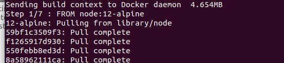</center>

    显示以下图片意为安装完成

    <center></center>

4.  构建完成后就可以使用命令`docker run -dp 3000:3000 getting-started`启动应用程序
5.  在浏览器访问<http://localhost:3000> 便可以看到效果


    <center></center>
### 2.  **更新应用程序**
1.  更新src/static/js/app.js文件第56行中的

    `<p className="text-center">No items yet! Add one above!</p>`替换为

    `<p className="text-center">You have no todo items yet! Add one above!</p>`

2.  使用`docker ps`命令获取容器ID，使用`docker stop <容器的id>`来停止该容器，最后使用`docker rm <容器的id>`来删除容器
4.  再次使用`docker build -t getting-started . `（注意后面有个点）更新镜像，并用老命令`docker run -dp 3000:3000 getting-started`启动，
5.  在浏览器访问http://localhost:3000 便可以看到效果


    <center>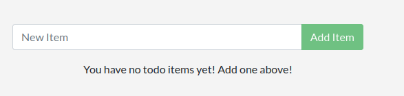</center>

### 3.  **共享应用程序**
1.  注册登录Docker Hub网站(hub.docker.com)，并在网站上创建一个仓库，名称自取取为getting-started权限定为Public


    <center>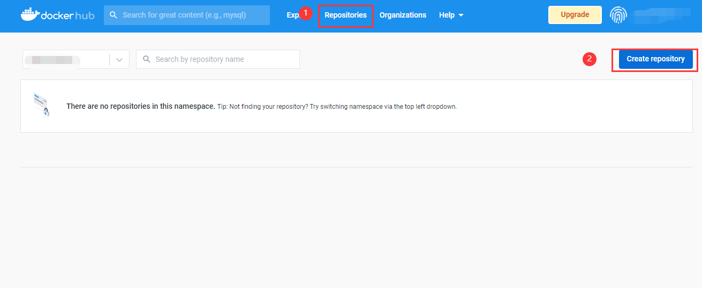</center>
    创建完成后，会出现Docker命令

    <center>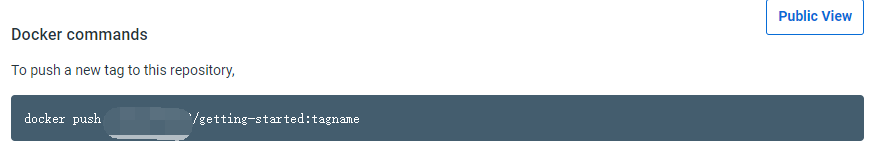</center>
2.  在Ubuntu的终端使用命令`docker login -u （你的用户名）` 登录到Docker Hub中登陆成功后会显示下图字段

    <center>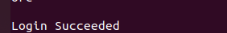</center>
3.  使用`docker tag getting-started （你的用户名）/getting-started `命令为getting-started 镜像指定一个新的名称
4.  再次使用`docker push （你的用户名）/getting-started`命令上传至远程仓库，且若没有指定版本号，它会默认指定为latest
### 4.  **持久化数据库**
1.  在Ubuntu的终端中使用`sudo su -`获取超级用户权限后，使用以下命令创建一个容器，且在该容器内创建一个包含一个1到10000之间的随机数的data.txt文件（第一部分选择随机数写入data.txt，第二部分只是监视文件以保持容器运行）

    > docker run -d ubuntu bash -c "shuf -i 1-10000 -n 1 -o /data.txt && tail -f /dev/null"

2.  使用`docker exec <容器id> cat /data.txt`命令查看data.txt内的数据


    <center>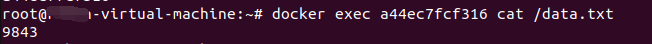</center>

3.  使用以下命令继续创建另一个容器，由于data.txt文件仅被写入第一个容器的暂存空间，所以会发现第二个容器内并没有data.txt文件：

    > docker run -it ubuntu ls /

4.  继续并使用`docker rm -f <容器id>`删除第一个容器
5.  使用`docker volume create <数据卷名称>`命令创建数据卷，并使用查看是否存在同名的容器，若有则使用`docker rm -f <容器id>`将其删除
6.  使用命令`docker run -dp 3000:3000 -v todo-db:/etc/todos getting-started`创建启动数据卷并挂载到/etc/todos路径上，且可以通过浏览器启动


    <center>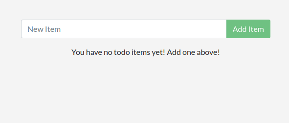</center>

    可以在其中添加一些代办事项


    <center>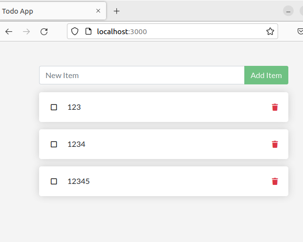</center>

7.  停止并删除todo容器，并将其删除，使用上述命令创建一个新容器，打开页面后可以看到待办事项仍在列表中

    <center>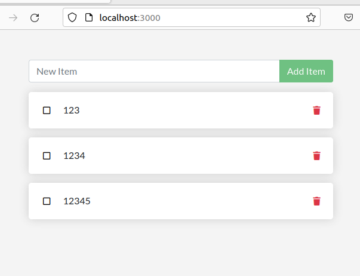</center>

### 5.  **使用绑定挂载**
1.  确保没有docker内没有活跃的容器后，用`cd /home/???/getting-started-master/app `(问号为getting-started-master所在位置)转到app文件夹中，使用命令
    ```
     docker run -dp 3000:3000 \\  
     \-w /app -v "\$(pwd):/app" \\  
     node:12-alpine \\  
     sh -c "yarn install && yarn run dev"  
     （-dp 3000:3000 ：以后台模式运行并创建端口映射  
     \-w /app ：设置“工作目录”或命令将运行的当前目录  
     \-v "\$(pwd):/app" ：将容器中主机的当前目录绑定挂载到/app目录中
    ```
    > node:12-alpine ：要使用的镜像。这是来自 Dockerfile 的应用程序的基础镜像

    > sh -c "yarn install && yarn run dev"：使用sh（alpine 没有bash）启动一个 shell 并运行yarn install以安装所有依赖项，然后运行yarn run dev。）

2.  使用`docker logs -f <容器id>`查看日志，如果出现以下图片，便表示已经就绪

    <center>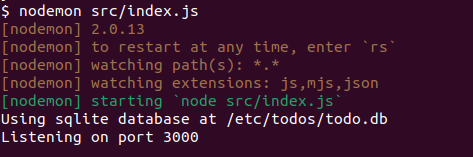</center>

3.  对src/static/js/app.js文件第109行进行修改，将

    `{submitting ? 'Adding...' : 'Add Item'}`修改为

    `{submitting ? 'Adding...' : 'Add'}` 

    刷新或重新打开浏览器页面后，页面会变为以下样式

    <center>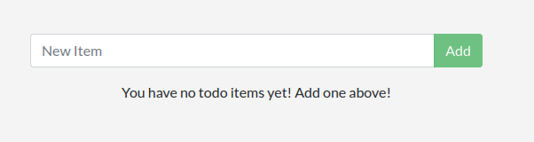</center>

4.  任意修改后，使用`docker stop \<容器id\>`将容器停止，并使用`docker build -t getting-started . `（注意：最后有个点）构建新镜像，出现下图即为成功


    <center>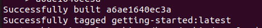</center>
### 6.  **多容器应用**
1.  启动MySQL，首先用命令`docker network create todo-app`创建网络，再使用以下命令启动MySQL容器并将其连接到网络
    ```
    docker run -d \\
    \--network todo-app --network-alias mysql \\
    \-v todo-mysql-data:/var/lib/mysql \\
    \-e MYSQL_ROOT_PASSWORD=secret \\
    \-e MYSQL_DATABASE=todos \\
    mysql:5.7
    ```
    显示以下图片即为成功安装，并使用`docker exec -it \<MySQL容器id\> mysql -u root -p `命令进行检测是否已连接


    <center>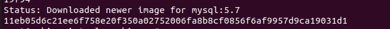</center>

    出现密码提示，输入 `secret` 后进入mysql shell，命令行开头变为“mysql\>”

    <center>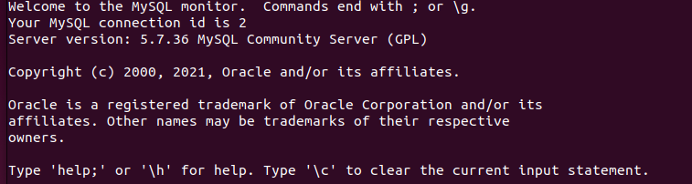</center>

    继续输入`SHOW DATABASES;`（注意：这最后有个分号）,便会出现以下输出

    <center>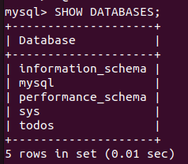</center>

2.  用命令`exit` 返回机器上原本的shell，并使用nicolaka/netshoot 镜像启动一个新容器。确保将其连接到同一网络，命令如下：

    > docker run -it --network todo-app nicolaka/netshoot

    由于之前并没有安装过netshoot镜像，所以系统会先安装，安装完成后会显示以下图片

    <center>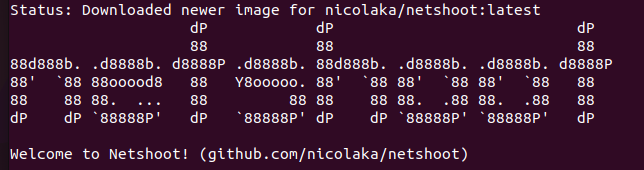</center>

    同时，它会进入容器内部，在内部使用`dig mysql`命令，就可以查找主机名mysql的IP地址，显示为下图

    <center>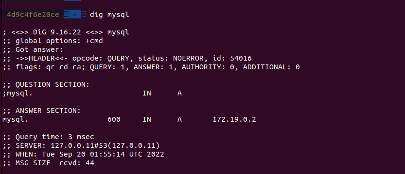</center>

3.  指定运行MySQL的主机名、用户名、密码及连接后使用的数据库，并将容器连接到应用程序网络
    ```
    docker run -dp 3000:3000 \
    -w /app -v "\$(pwd):/app" \
    --network todo-app \
    -e MYSQL_HOST=mysql \
    -e MYSQL_USER=root \
    -e MYSQL_PASSWORD=secret \
    -e MYSQL_DB=todos \
    node:12-alpine \
    sh -c "yarn install && yarn run dev"
    ```
    此时，若使用`docker logs <容器id> `命令，便可看到其中有以下信息，表明它正在使用mysql数据库


    <center>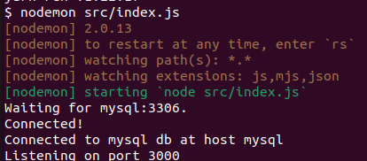</center>

    打开浏览器，将一些待办事项添加到列表，并使用命令`docker exec -it <mysql容器id> mysql -p todos `（todos是数据库名）连接数据库（密码是`SECRET`），在mysql shell中运行 `select * from todo_items;` 命令，便会显示结果

    <center>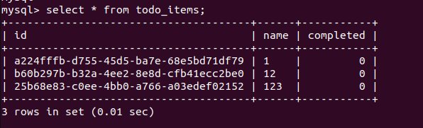</center>

    这里，多容器应用就告一段落。

### 7.  **使用Docker Compose**
1.  首先安装docker compose，使用命令`sudo apt-get update `和`sudo apt-get install docker-compose-plugin`更新报索引，并使用`apt install docker-compose`安装最新版本Docker Compose，安装完成后使用命令`docker-compose -version `便可查看是否正确安装。如下图所示，格式为Docker Compose version vN.N.N

    <center>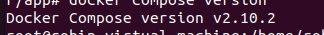</center>

2.  在app文件夹中创建一个名为docker-compose.yml 的文件，撰写文件内容时首先需要指定版本，大部分情况下最好使用最新版本，如果不想使用最新版本，可以参考 https://docs.docker.com/compose/compose-file/ 该网站来使用。
3.  将应用服务迁移到compose文件中，以下为shell内原命令：
    ```
    docker run -dp 3000:3000 \
    -w /app -v "$(pwd):/app" \
    --network todo-app \
    -e MYSQL_HOST=mysql \
    -e MYSQL_USER=root \
    -e MYSQL_PASSWORD=secret \
    -e MYSQL_DB=todos \
    node:12-alpine \
    sh -c "yarn install && yarn run dev"

    ```
    以下为需要写入到compose文件内的代码
    ```
    version: "3.7"

    services:
        app:
            image: node:12-alpine
            command: sh -c "yarn install && yarn run dev"
            ports:
            - 3000:3000
            working_dir: /app
            volumes:
            - ./:/app
            environment:
            MYSQL_HOST: mysql
            MYSQL_USER: root
            MYSQL_PASSWORD: secret
            MYSQL_DB: todos
    ```
    > App:image：为容器定义服务入口和镜像

    > Command：接近镜像定义的内容，可直接移入

    > Ports：迁移自“-p 3000:3000”，这里使用的是短语法，也可使用长语法

    > Working_dir和Volumes：迁移工作目录（-w/app）和数据卷映射（-v ”\$(pwd):/app”）

    > Environment：定义环境变量

4.  将MySQL服务迁移到compose文件中，原shell命令如下：
    ```
    docker run -d \
    --network todo-app --network-alias mysql \
    -v todo-mysql-data:/var/lib/mysql \
    -e MYSQL_ROOT_PASSWORD=secret \
    -e MYSQL_DATABASE=todos \
    mysql:5.7
    ```
    以下为写入到compose文件中的代码
    ```
    version: "3.7"
    services:
        app:
            # The app service definition
        mysql:
            image: mysql:5.7
            volumes:
            - todo-mysql-data:/var/lib/mysql
            environment:
            MYSQL_ROOT_PASSWORD: secret
            MYSQL_DATABASE: todos

    volumes:
    todo-mysql-data：

    ```
    而最终整体的compose文件为
    ```
    version: "3.7"

    services:
    app:
        image: node:12-alpine
        command: sh -c "yarn install && yarn run dev"
        ports:
        - 3000:3000
        working_dir: /app
        volumes:
        - ./:/app
        environment:
        MYSQL_HOST: mysql
        MYSQL_USER: root
        MYSQL_PASSWORD: secret
        MYSQL_DB: todos

    mysql:
        image: mysql:5.7
        volumes:
        - todo-mysql-data:/var/lib/mysql
        environment:
        MYSQL_ROOT_PASSWORD: secret
        MYSQL_DATABASE: todos

    volumes:
    todo-mysql-data:

    ```
5.  完成docker-compose.yml文件后，就可以启动（启动前先确保没有其他正在运行的容器）。使用`docker-compose up -d`使用命令启动应用程序堆栈（-d标志表示后台运行所有内容），结果为以下输出
    <center>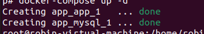</center>

    再使用命令`docker-compose logs -f `查看日志，会看到很多日志信息，其中有以下输出：

    <center>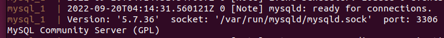</center>

    <center>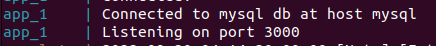</center>

6.  全部结束只需要输入`docker-compose down`即可，容器将停止，网络将被删除，而若要删除数据卷，需要添加--volumes标志
