## 1.  **实验名称：**
&ensp;&ensp;&ensp;&ensp;Linux系统下Docker的安装

## 2.  **实验目的**
1.  安装虚拟机及Ubuntu
2. 在Ubuntu内安装Docker
## 3. **实验环境**

&ensp;&ensp;&ensp;&ensp;Windows 10，虚拟机“VMware workstation Pro 16”

## 4.  **实验内容及步骤**
### 1.  安装虚拟机
1.  前往VMware workstation官网下载VMware workstation Pro 16或直接使用<https://www.vmware.com/products/workstation-pro/workstation-pro-evaluation.html> 网址前往安装VMware workstation Pro 16
2.  使用安装包安装完成，并上网找可用的许可证（如：ZF3R0-FHED2-M80TY-8QYGC-NPKYF），完成对VMware 的激活
### 2.  安装Ubuntu
1. 前往镜像网站<http://mirrors.163.com/ubuntu-releases/> ，点击22.04/进入下载Ubuntu22.04界面，再点击ubuntu-22.04.1-desktop-amd64.iso 下载Ubuntu 22.04 桌面版镜像文件，这里使用的是网易镜像，也可以使用阿里云等镜像文件。
2. 点击打开.exe文件  
    > 新建虚拟机

    

 

    > 选项默认，下一步

    
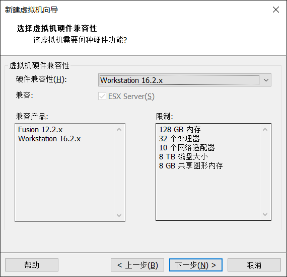

    > 选择iso安装的路径，下一步

    
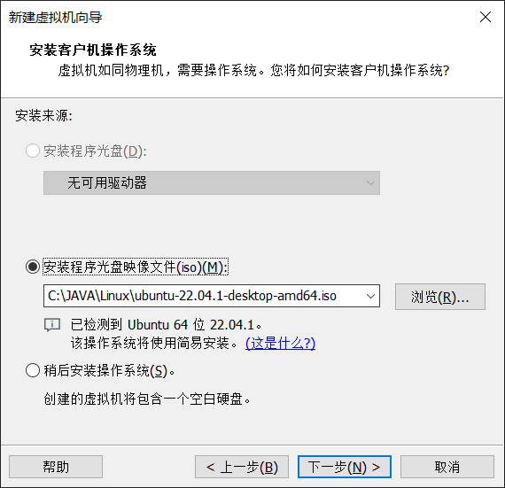

    > 编写名称、用户名、密码

    
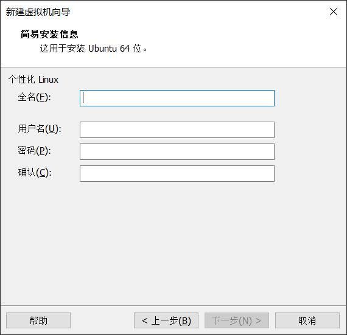

    > 编写虚拟机名称及位置

    
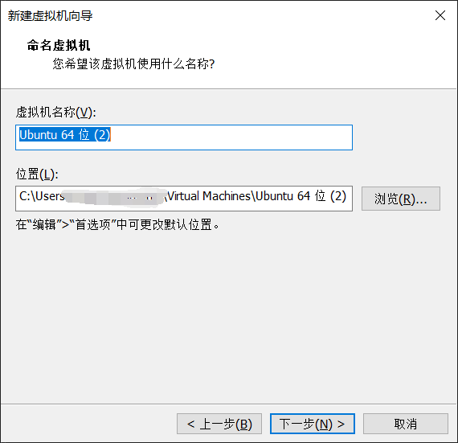

    > 输入处理器及内核数量（一般处理器及内核不超过笔记本电脑的1/2）

    
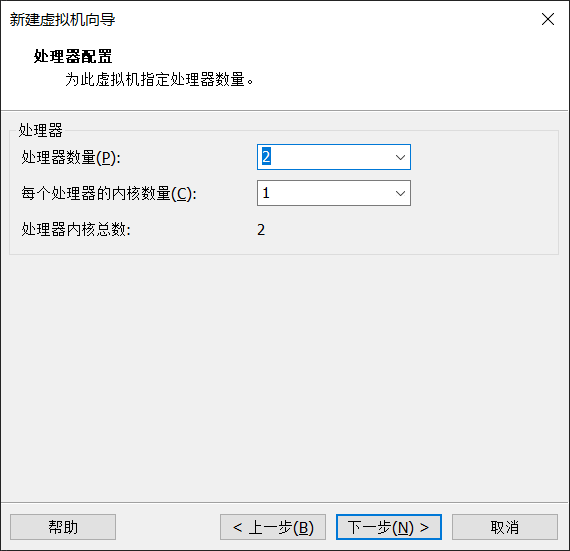

    > 输入内存（一般内存不能超过笔记本电脑内存的1/2）

    
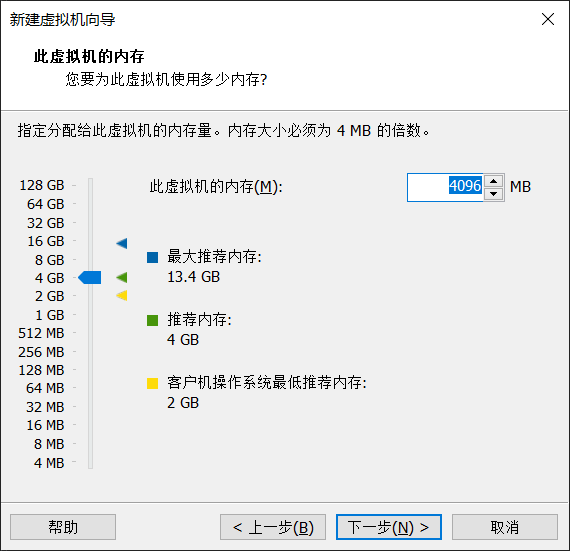

    > 对网络类型进行选择，如果局域网里有足够的IP，就用桥接网络，否则就用NAT模式

    
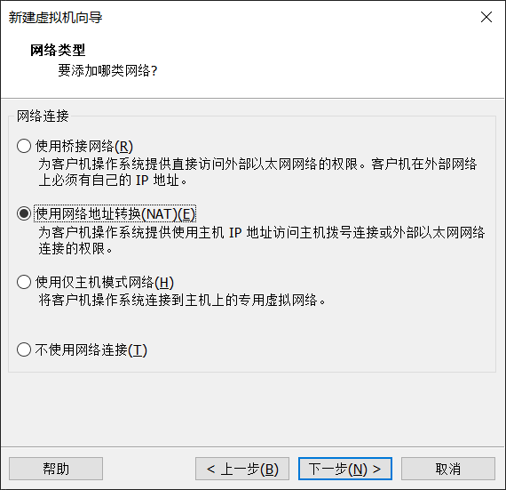

    > 选择默认推荐，下一步

    

    > 选择默认推荐，下一步

    

    > 选择创建新虚拟磁盘

    
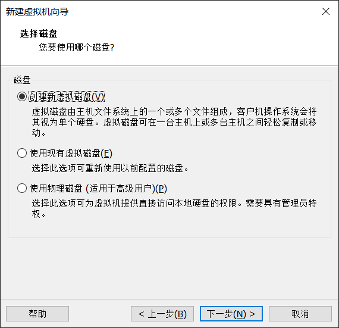

    > 一般默认20G就够了，如果要装的软件特别多就多分配一点，一般空的Ubuntu装完占用10G左右，剩10G软件空间。  
    > 磁盘文件选单个文件，否则文件数量比较多，不利于分发和管理。

    

    > 填写磁盘文件名

    
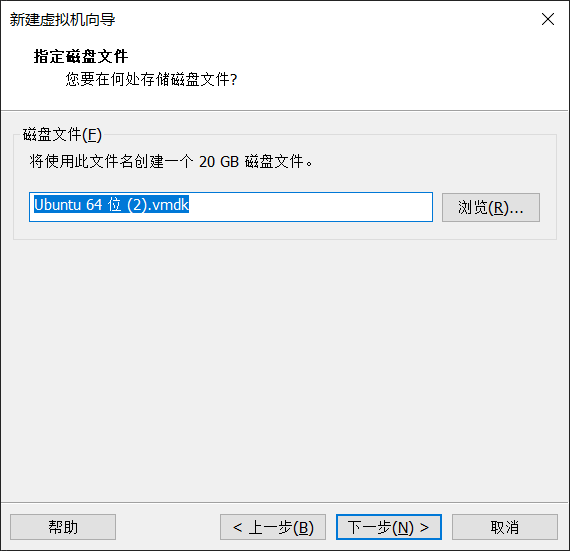

    > 点击完成

    
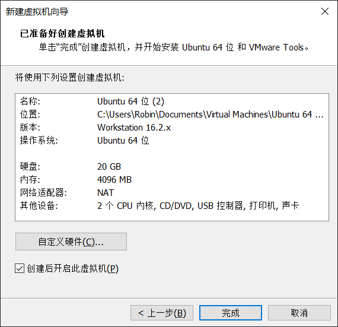

### 3.在Ubuntu内安装Docker
1.  更新apt包索引（更新时会提示输入密码且输入时不会有任何反馈，直接输入完后回车就行）：

    > sudo apt-get update

2.  安装 apt 依赖包，用于通过HTTPS来获取仓库:

    > sudo apt-get install apt-transport-https ca-certificates curl gnupg-agent software-properties-common

3.  安装GPG证书

    > curl -fsSL http://mirrors.aliyun.com/docker-ce/linux/ubuntu/gpg \| sudo apt-key add -

5.  使用以下指令来设置稳定版仓库

    > sudo add-apt-repository \\  
    > "deb [arch=amd64] https://mirrors.ustc.edu.cn/docker-ce/linux/ubuntu/ \\  
    > \$(lsb_release -cs) \\  
    > stable"

6.  安装Docker Engine-Community 和 containerd（安装最新版本）：

    > sudo apt-get install docker-ce docker-ce-cli containerd.io

    安装Docker Engine-Community 和 containerd（安装特定版本）：

    使用命令查询相应版本的版本号：`apt-cache madison docker-ce`

    使用第二列中的版本字符串安装特定版本，例如5:20.10.12\~3-0\~ubuntu-bionic：   
    > sudo apt-get install docker-ce=\<VERSION_STRING\> docker-ce-cli=\<VERSION_STRING\> containerd.io

7.  检查docker是否安装成功

    测试Docker是否安装成功，输入指令，打印出以下信息则安装成功:

    > sudo docker run hello-world

    
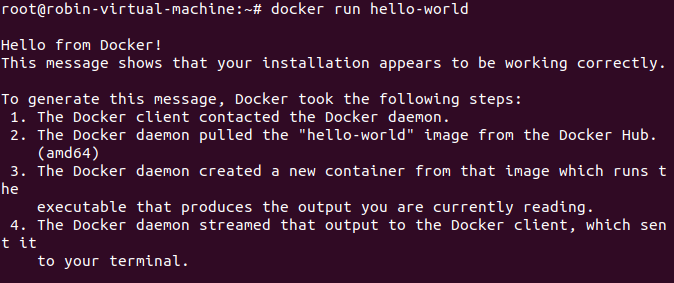

