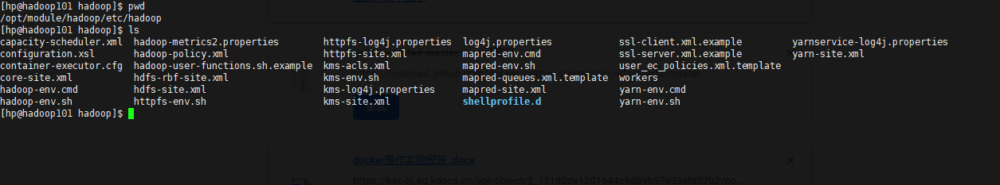
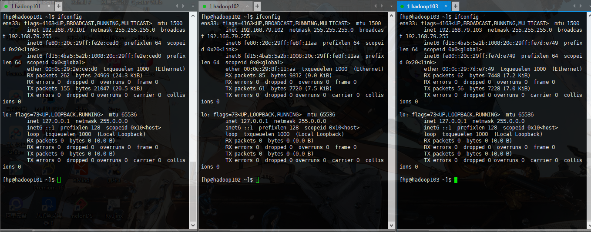
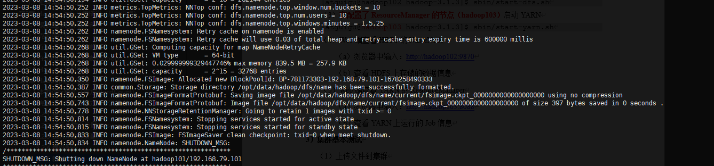

# 实验名称：

Hadoop的安装

# 实验目的

（1）掌握hadoop的完全分布式安装

（2）掌握hdfs shell的基本使用

# 实验环境

Centos7

# 四、实验内容及步骤

## 1. linux配置

**在root用户下操作**

### （1）关闭防火墙

### （2）添加IP地址和主机名之间的映射

输入命令vim /etc/hosts

在文件hosts中添加地址和映射名

### （3）设置静态ip地址

vim /etc/sysconfig/network-scripts/ifcfg-ens33

### （4）修改主机的hostname

在命令行输入 hostnamectl set-hostname [主机名]

重启

查看ip地址，看有没有配置成功

### （5）创建用户

\# 添加用户名

useradd 用户名

\# 设置密码

passwd 用户名

### （6）配置免密码登录

vim /etc/sudoers

### （7）重启 reboot

## 2. jdk安装

**在自定义用户下进行操作，这里以用户hp为例**

### （1）在/opt下新建文件夹kit、module、packages

kit放jdk

module放hadoop

packages放上传的软件包

sudo mkdir /opt/kit /opt/module /opt/packages

sudo chown hp:hp -R /opt/kit /opt/module

sudo chmod 777 -R /opt/packages

### （2）上传jdk，并查看

### （3）解压到目标文件夹

### （4）重命名

### （5）配置环境变量

vim \~/.bash_profile

### （6）验证java安装完成

## 3. hadoop安装

### （1）上传hadoop到/opt/packages，并解压到/opt/module

### （2）配置环境变量

vim \~/.bash_profile

source \~/.bash_profile

### （3）进入/opt/hadoop/etc/hadoop目录，修改配置文件

主要是hadoop-env.sh、mapred-env.sh、yarn-env.sh

core-site.xml、hdfs-site.xml、mapred-site.xml、yarn-site.xml

workers

env结尾的文件，在文件中加入export JAVA_HOME=/opt/kit/jdk8

#### core-site.xml

\<configuration\>

\<property\>

\<name\>fs.defaultFS\</name\>

\<value\>hdfs://hadoop101:9000\</value\>

\</property\>

\<!--指定数据存放的位置，没有这个文件夹，需要自己建--\>

\<property\>

\<name\>hadoop.tmp.dir\</name\>

\<value\>/opt/data/hadoop\</value\>

\</property\>

\<property\>

\<name\>hadoop.proxyuser.hp.hosts\</name\>

\<value\>\*\</value\>

\</property\>

\<property\>

\<name\>hadoop.proxyuser.hp.groups\</name\>

\<value\>\*\</value\>

\</property\>

\<property\>

\<name\>hadoop.proxyuser.root.hosts\</name\>

\<value\>\*\</value\>

\</property\>

\<property\>

\<name\>hadoop.proxyuser.root.groups\</name\>

\<value\>\*\</value\>

\</property\>

\<property\>

\<name\>io.compression.codecs\</name\>

\<value\>

org.apache.hadoop.io.compress.GzipCodec,

org.apache.hadoop.io.compress.DefaultCodec,

org.apache.hadoop.io.compress.BZip2Codec,

org.apache.hadoop.io.compress.SnappyCodec,

com.hadoop.compression.lzo.LzoCodec,

com.hadoop.compression.lzo.LzopCodec

\</value\>

\</property\>

\<property\>

\<name\>io.compression.codec.lzo.class\</name\>

\<value\>com.hadoop.compression.lzo.LzoCodec\</value\>

\</property\>

\</configuration\>

#### hdfs-site.xml

\<configuration\>

\<property\>

\<name\>dfs.replication\</name\>

\<value\>3\</value\>

\</property\>

\<!-- 指定Hadoop辅助名称节点主机配置 --\>

\<property\>

\<name\>dfs.namenode.secondary.http-address\</name\>

\<value\>192.168.79.103:50090\</value\>

\</property\>

\<property\>

\<name\>dfs.safemode.threshold.pct\</name\>

\<value\>0f\</value\>

\</property\>

\</configuration\>

#### mapred-site.xml

\<configuration\>

\<property\>

\<name\>mapreduce.framework.name\</name\>

\<value\>yarn\</value\>

\</property\>

\<property\>

\<name\>yarn.app.mapreduce.am.env\</name\>

\<value\>HADOOP_MAPRED_HOME=\${HADOOP_HOME}\</value\>

\</property\>

\<property\>

\<name\>mapreduce.map.env\</name\>

\<value\>HADOOP_MAPRED_HOME=\${HADOOP_HOME}\</value\>

\</property\>

\<property\>

\<name\>mapreduce.reduce.env\</name\>

\<value\>HADOOP_MAPRED_HOME=\${HADOOP_HOME}\</value\>

\</property\>

\</configuration\>

#### yarn-site.xml

\<configuration\>

\<!-- Site specific YARN configuration properties --\>

\<!-- Reducer获取数据的方式 --\>

\<property\>

\<name\>yarn.nodemanager.aux-services\</name\>

\<value\>mapreduce_shuffle\</value\>

\</property\>

\<!-- 指定YARN的ResourceManager的地址 --\>

\<property\>

\<name\>yarn.resourcemanager.hostname\</name\>

\<value\>hadoop102\</value\>

\</property\>

\<!-- 日志聚集功能使能 --\>

\<property\>

\<name\>yarn.log-aggregation-enable\</name\>

\<value\>true\</value\>

\</property\>

\<!-- 日志保留时间设置7天 --\>

\<property\>

\<name\>yarn.log-aggregation.retain-seconds\</name\>

\<value\>604800\</value\>

\</property\>

\<property\>

\<name\>yarn.scheduler.maximum-allocation-mb\</name\>

\<value\>4096\</value\>

\</property\>

\<property\>

\<name\>yarn.scheduler.minimum-allocation-mb\</name\>

\<value\>4096\</value\>

\</property\>

\<property\>

\<name\>yarn.nodemanager.vmem-pmem-ratio\</name\>

\<value\>5.0\</value\>

\</property\>

\<property\>

\<name\>mapred.child.java.opts\</name\>

\<value\>-Xmx1024m\</value\>

\</property\>

\<property\>

\<name\>yarn.nodemanager.pmem-check-enabled\</name\>

\<value\>false\</value\>

\</property\>

\<property\>

\<name\>yarn.nodemanager.vmem-check-enabled\</name\>

\<value\>false\</value\>

\</property\>

\<property\>

\<name\>yarn.log.server.url\</name\>

\<value\>http://hadoop102:19888/jobhistory/logs\</value\>

\</property\>

\</configuration\>

#### workers

hadoop101

hadoop102

hadoop103

### （4）克隆两台虚拟机，hadoop102、hadoop103

### （5）修hadoop102和hadoop103的hostname和ip地址

分别重启hadoop102和hadoop103

### （6）检查基础配置

### （7）配置ssh免密

在hadoop101上的hp用户下操作

#### 1） ssh-keygen -t rsa

按三次回车

#### 2） 发送公钥到本机

ssh-copy-id hadoop101

输入一次密码

#### 3）分别ssh登陆一下所有虚拟机

#### 4）把/home/hp/.ssh 文件夹发送到hadoop102、hadoop103

#### 5）验证免密码

### （8）初始化hadoop

在hadoop101下的hp用户下操作；如果失败初始化，查看日志，排错后，删data文件夹，重新执行命令

cd /opt/module/hadoop

hadoop namenode -format

（9）启动集群

在hadoop101上的hadoop_home下执行

sbin/start-dfs.sh

在hadoop102上的hadoop_home下执行

sbin/start-yarn.sh

### （9）web页面查看

## 4. hdfs shell的基本使用

### （1）命令大全

在hadoop_home下输入bin/hadoop fs

### （2）上传

新建文件夹

hadoop fs -mkdir /test

查看文件夹创建成功

hadoop -fs copyFromLocal [本地文件] [hdfs上的路径]

hadoop -fs put [本地文件] [hdfs上的路径]

### （3）下载

hadoop fs -copyToLocal [hdfs上的文件] [本地路径]

hadoop fs -get [hdfs上的文件] [本地路径]

### （4）查看hdfs上的文件

hadoop fs -ls /

### （5）显示文件内容

hadoop fs -cat [hdfs上的文件]

### （6）在hdfs上拷贝文件到另一个文件夹

hadoop -cp [hdfs上的目标文件] [目标路径]

### （7）在hdfs上移动文件位置

### （8）删除文件或文件夹

### （9）统计文件夹的大小信息

